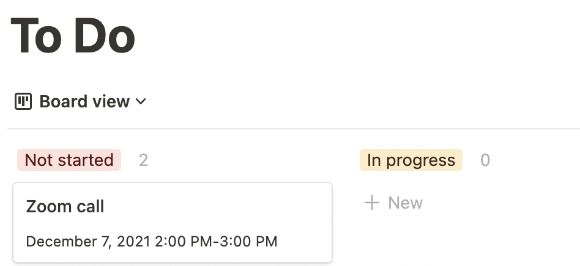
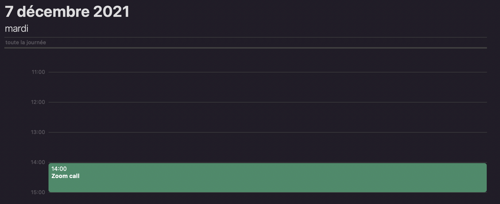

# Automated synchronization of Notion databases and Apple Calendar

Do you often use Notion board databases for **roadmaps** or for your day-to-day **todos** ? Do you want your tasks to be automatically added to your Apple Calendar when a date is defined ? Hopefully you are on the good *repo*.

In brief here is a typical use case :  

1. You add a **task** in your board database, with a date specified

1. This **task** will be added to your Apple Calendar app


Then if the Notion card got modified or deleted, the changes will automatically be taken into account in the Apple Calendar.

*Note :* The synchronizations are trigered based on the crontab job you will define.

## Installation

In this section, I go through all the necessary steps to set up the project on your local machine.

### Requirements
* macOS version 10.5 or later
* tested on python version 3.8.12
* pip requirements can be found [here](./requirements.txt)

If the previous requirements are fulfilled then follow these steps :

1. Clone the repository in your desired location  
    A repository is like a folder on GitHub. This repository contains all the code needed to run the project.  
    To get the repository on your computer you need to clone it, this will download a copy of all files on your computer. To do so :  
    1. Open up your Terminal application
    1. Check if git is installed :
        ```shell
        git --version
        ``` 
        You should get output like :

        ```shell
        git version 2.32.0 (Apple Git-132)
        ```
        Otherwise check the [official documentation](https://git-scm.com/book/en/v2/Getting-Started-Installing-Git) to install the git client.
    1. Move to your desired location
        
        Inside your terminal app **cd** to the location where you want to clone the repository
        
        As matter of example :
        
        ```shell
        cd /Users/sprietthibault/scripts/
        ```
    
    1. Clone the repository

    ```shell
    git clone https://github.com/thibaultspriet/SyncNotionCalendar.git
    ```
1. In your python environment run :
    ```shell
    pip install -r requirements.txt
    ```

### Notion integration

You will have to create an internal integration in the Notion app. If you want to know how to get the Notion integration token, more info [here](https://developers.notion.com/docs/authorization).  

### Config file

After that, you need to create a config file in the root directory of the project. Name it **config.ini** and fill it as follow :

```ini
[GLOBAL]
NOTION_TOKEN=<your notion integration token>
APPLE_CALENDAR=<Name of your Apple Calendar>

[DATABASES]
<your chosen database name 1>=<notion database id>
<your chosen database name 2>=<notion database id>
```

You can add as many as you want **DATABASES** entries.

💡 do not forget to share your database to your integration

### Crontab job

Once you have done all the previous tasks, you only need to create a crontab job to run your task with the frequency you want.

Firstly edit [this script](./syncNotionCalendar.zsh) with your python interpreter path and your actual path to [main.py](./main.py)

Then open up a terminal and create a crontab job as follow :

```shell
crontab -e
```

It will open a vim editor.

Write : * * * * * cd <absolute path to the project> && <./syncNotionCalendar.zsh>

You can edit * * * * * to configure when to run the job.

💡 use [this site](https://crontab.guru) to generate the command.

## Questions

In case you have a question, feel free to email me to [thibaultspriet@outlook.fr](mailto:thibaultspriet@outlook.fr)